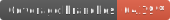

# KIT-PSE_Sensor Ultra-lightweight Supervision: Active Meteorological Observation General Use System

## Quick Start
Using the KIT-PSE_Sensor Ultra-lightweight Supervision is a six-step process:

1. Clone this repository into a directory of your choise
2. Modify environment variables in `docker-compose.yml`
3. Install Docker and Docker Compose
4. Build the project with the command `docker-compose build`
5. Run the docker-container with the command `docker-compose up`
6. Access the webapp `http://localhost:3001/`

There may be some issues with using Docker with Windows for deploying the system.
It definitely works for Linux environments. We didn't experience problems with Intel Macs too.

## How to use the webseite
To have the best user experience, it is important to **log in** first. For this you only need an email address. To access your account, you will receive a new login code for verification every time you log in.

After you have logged in, you can either **subscribe** to one or more things. Then, depending on your choice, you will receive an email if the specified thing is down or a regular report about this thing.\
Alternatively you can **replay** one or more things. Using the replay page you can now decide about the time period and the speed with which the replay should be executed.\
You can also **export** the data of a datastream over a period of time as a CSV file on the information page of a datastream.

## How to use the Replay
The replay page can be used to make the settings for the replay. After pressing Play you will see a link to the actual replay. 
link to the actual replay will be displayed. As soon as you open this link for the first time, the replay will start.

If you want to start the replay without the web page, you can also do this. For this you have to make a POST Http request
to http://localhost:3001/api/backend/observation/newSSE. The content type is application/json. As JSON
the settings will be passed manually.  
The JSON file has the format:
```
{"start": "DD/MM/YYYY HH:MN:SS", "end": "DD/MM/YYYY HH:MN:SS", "speed":NUM, "sensors":["thingID"]}
```
as an example with the dates:  
Start: `21/09/2021 12:00:00`  
End: `23/09/2021 12:00:00`  
Speed: `100`  
Sensors: `saqn:t:43ae704`  
```JSON
{"start": "21/09/2021 12:00:00", "end": "23/09/2021 12:00:00", "speed":100, "sensors":["saqn:t:43ae704"]}
```

## Configuration

The configuration can completely be changed in `docker-compose.yml`, when you use docker for deploying the project.

### System e-mail address
The e-mail address with which the alert, report, and confirmation code e-mails are sent can be changed using Docker's environment variables
in the `docker-compose.yml` file.  
The variables `MAIL_USERNAME` and `MAIL_PASSWORD` contain the e-mail address and password.  
This allows users
to have the e-mails sent from custom mail addresses. Note however, that the mails are sent with Google's GMail. The custom mails must therefore
also be GMail addresses.  
If you don't want to use Docker, you can use the `application.properties` file in `notification/src/main/resources`.

## Coverage
Code coverage backend:                \
Code coverage notification system:    \
Code coverage frontend:    
